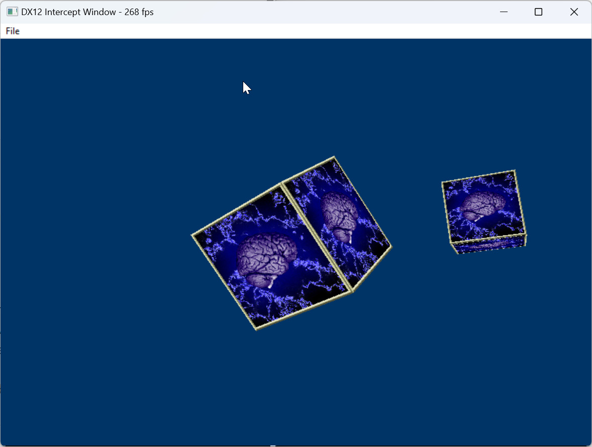
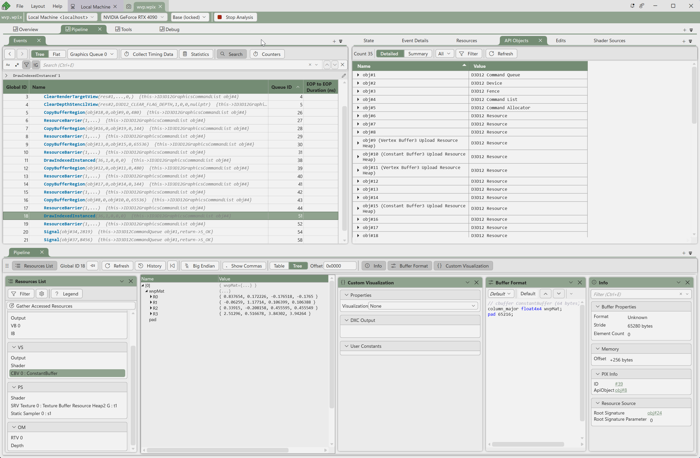
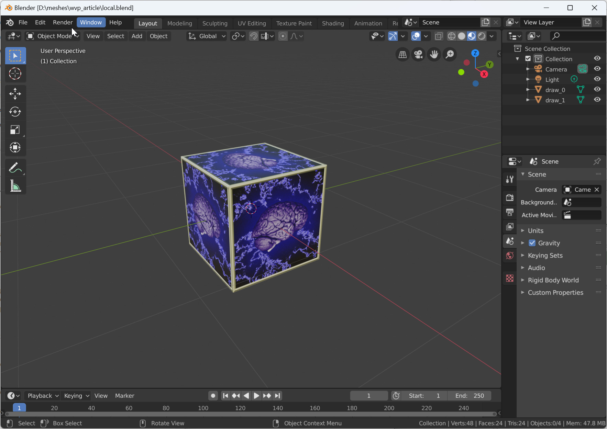
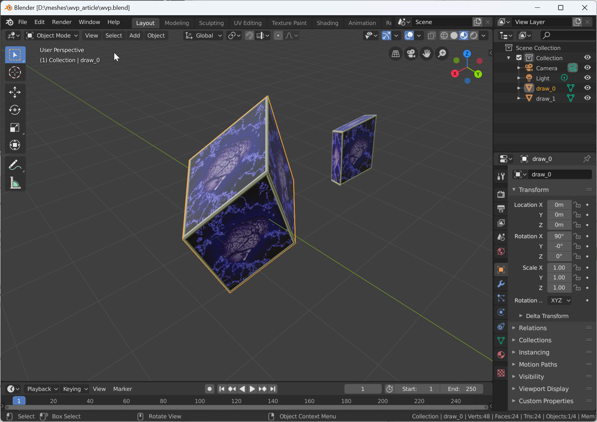
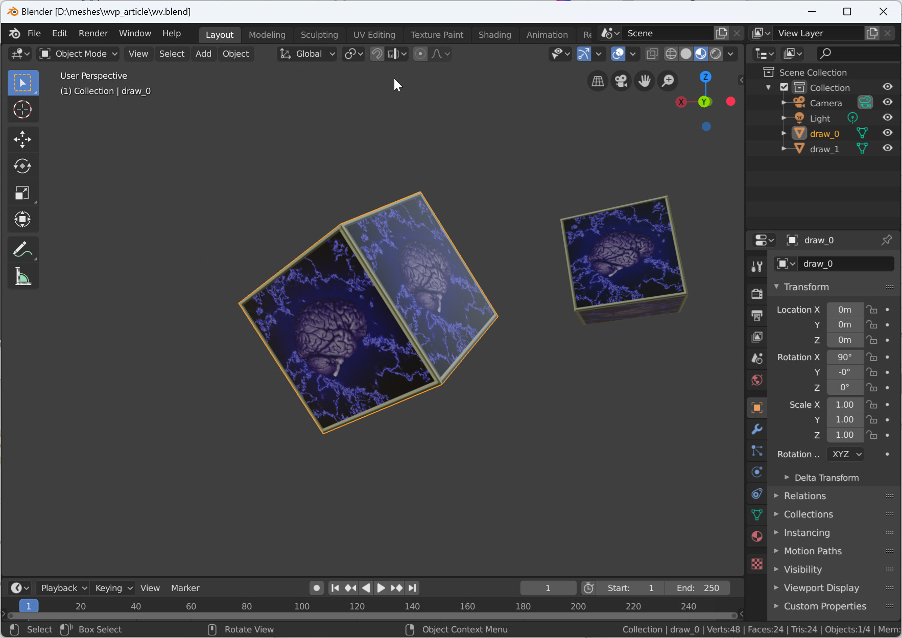

# WVP
Tools that allow extraction of a WV matrix from a WVP matrix, so you can transform geometry correctly if all you have is a WVP from vertex shader inputs.

__Q:__ Can you extract a world (or world-view) matrix from a World-View-Projection matrix? Some apps might only provide a WVP matrix to vertex shader inputs. If you intercept them you can't transform geometry into world space. Transforming using the WVP matrix leads to geometry that has been distorted from the projection matrix. I need the world (or world-view) matrix so I can transform geometry without distortion.

__A:__ Yes you can extract the world-view matrix from a World-View-Projection matrix. The key is guessing the projection matrix, and multiplying the WVP matrix by the inverse projection matrix. One way of guessing the projection matrix is by parameterizing the matrix, transforming a 1x1x1 cube by the WVP*P^-1, and checking how close the 1x1x1 cube edges are - is it still 1x1x1 or has it been distorted? You can do a simple coarse search to find the parameters with the least error, or use an algorithm like Nelder-Mead to do a more refined search.

Here is an example app that displays two cubes like BZTuts 10. I have stored an archive of the original webpage in case it ever goes down: [BzTuts10_archive.7z](https://github.com/ryan-de-boer/WVP/raw/refs/heads/main/archive/BzTuts10_archive.7z)


Here is showing PIX displaying the second cubes WVP matrix (row major). PIX (or renderdoc) is useful to understand the WVP matrix if you app supports it.


Here is showing exported the geometry using just local coordinates (no transform). Both cubes are on top of each other at the origin. If you don't have much geometry you could manually move them in place - eg a tree might just have 2 meshes one for the trunk, one for the leaves. But if your working on a car game, its possible the car has 100 meshes - too many to manually place.


Here is showing the distortion that takes place if you use the WVP matrix. The two cubes appear squashed. It is this squashing behaviour we want to stop.


Here is a python script that shows how to do a coarse search and a refined search using Nelder-Mead to come up with the parameters for the projection matrix. It is done for DirectX, and has comments for how you might change it for OpenGL.
[refine_bz.py](https://github.com/ryan-de-boer/WVP/raw/refs/heads/main/python/refine_bz.py)

Here we setup the cube we are going to see if it stays 1x1x1 after transforming.
```
import numpy as np
from scipy.optimize import minimize

# ---------- Define your WVP here ----------
# Replace with your actual 4x4 numpy array
#WVP = np.identity(4)  # placeholder
#209 CBV 2: CB1

#WARNING: numpy convention is COLUMN major
#row major defined, .T on the end transposes to column major
WVP = np.array([

 [1.33797, 0.955281, -0.546106, -0.546052],
 [-0.937522, 2.05715, -0.0830864, -0.0830781],
 [0.782967, 0.830887, 0.83375, 0.833667],
 [0, 0, 4.37257, 4.47214]

], dtype=np.float32).T

# ---------- Cube geometry ----------
cube = np.array([
    [0,0,0,1],
    [1,0,0,1],
    [0,1,0,1],
    [0,0,1,1],
    [1,1,0,1],
    [1,0,1,1],
    [0,1,1,1],
    [1,1,1,1]
], dtype=float)

edges = [(0,1),(0,2),(0,3),
         (1,4),(1,5),
         (2,4),(2,6),
         (3,5),(3,6),
         (4,7),(5,7),(6,7)]

```

We parameterize the projection matrix as based on fov_y_deg, aspect, near, far. We fix far to 10,000 because it needs to be big and we don't want to generate small values and it does not affect the skewness. Aspect ratio is just the window width/height which is 800/600. Then the only values we need to guess are field of view degrees and near. If near is not small (eg <1) then something has gone wrong.

```
#DX
def perspective(fov_y_deg, aspect, near, far):
    f = 1.0 / np.tan(np.radians(fov_y_deg)/2.0)
    m = np.zeros((4,4))
    m[0,0] = f/aspect
    m[1,1] = f
    m[2,2] = far/(far-near)
    m[2,3] = (-far*near)/(far-near)
    m[3,2] = 1
    return m
```
These are the key functions:
```
def cube_edge_error(WVP, P, printIt=False):
    try:
        P_inv = np.linalg.inv(P)
    except np.linalg.LinAlgError:
        return 1e9
#    M = WVP @ P_inv #GL
    M = np.linalg.inv(P) @ WVP #DX
    if printIt:
        print("Estimated World-View matrix (WVP * P_inv):\n", M)
    pts = (M @ cube.T).T
    pts = pts[:,:3] / np.clip(pts[:,3,None], 1e-9, None)
    err = 0.0
    for i,j in edges:
        d = np.linalg.norm(pts[i]-pts[j])
        err += (d-1.0)**2
    return err

# ---------- Coarse grid search ----------
def coarse_search(WVP, aspect, far, 
                  fov_range=(30,120,2.0),
                  near_values=(0.05,0.1,0.2,0.5,1.0)):
    best, best_err = None, float("inf")
    fmin, fmax, fstep = fov_range
    for fov in np.arange(fmin,fmax+1e-9,fstep):
        for n in near_values:
            if n >= far: 
                continue
            P = perspective(fov, aspect, n, far)
            err = cube_edge_error(WVP, P)
            if err < best_err:
                best_err = err
                best = (fov,n)
    return best, best_err

# ---------- Refine with Nelder–Mead ----------
def refine_params(WVP, aspect, far, init_guess):
    def cost(x):
        fov, n = x
        if fov <= 1 or fov >= 179: return 1e9
        if n <= 0 or far <= n: return 1e9
        P = perspective(fov, aspect, n, far)
        return cube_edge_error(WVP, P)

    res = minimize(cost, init_guess,
                   method="Nelder-Mead",
                   options={"maxiter":500,"xatol":1e-6,"fatol":1e-9})
    return res.x, res.fun

# ---------- Run ----------
aspect = 800/600  # set your aspect ratio
far = 10000

coarse_guess, coarse_err = coarse_search(WVP, aspect, far)
print("Coarse guess: fov=%.2f, near=%.3f, far=%.1f, err=%.6f" %
      (coarse_guess[0],coarse_guess[1],far,coarse_err))

refined_params, refined_err = refine_params(WVP, aspect, far, coarse_guess)
print("Refined: fov=%.6f, near=%.6f, far=%.6f, err=%.12f" %
      (refined_params[0],refined_params[1],far,refined_err)
```

It came up with:  
Coarse guess: fov=44.00, near=0.100, far=10000.0, err=0.002176  
Refined: fov=45.171178, near=0.099151, far=10000.000000, err=0.000002043851

Then you just need to do WVP*P^-1 and you have the WV matrix!

How well did we do? Since we have the source code to BZ Tuts 10 we can look at how the projection matrix is created:   
XMMatrixPerspectiveFovLH(45.0f*(3.14f/180.0f), (float)Width / (float)Height, 0.1f, 1000.0f);  
So we were pretty close guessing 45.17 for 45 and almost exact for near. Far is way off but it doesn't affect skewness. Ultimately we just want to remove distortion, so its OK if the projection matrix is not exactly the same as the app uses.

This is the result of exporting the scene using our estimated WV matrix. You can see the cubes are not distorted - yey.


Thanks to ChatGPT for assisting me turn the idea into reality.
